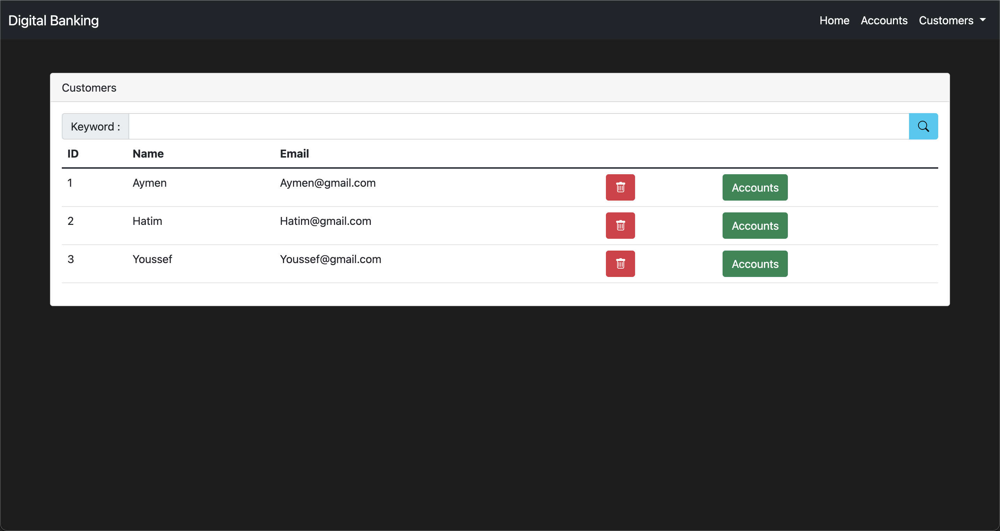

<h1 align="center">
  <a href="https://github.com/ach-code/Digital_Banking_FrontEnd_Angular">
   Digital Banking
  </a>
</h1>

La banque numérique fait partie du contexte plus large du passage à la banque en ligne, où les services bancaires sont fournis sur Internet.

Le passage de la banque traditionnelle à la banque numérique a été progressif et se poursuit, et est constitué de différents degrés de numérisation des services bancaires.

Cette Application est une simple digital banking solution avec des simple fonctions

    List des Client (List of Customers)
    Ajouter Client (Add Customer)
    Les Comptes Bancaires (Accounts)
    Débit
    Crédit
    Transfert

## Page Accueil
</img> 

## Liste des Clients
</img> 

## Page Ajouter Un Client
</img> 

## Page Compte
</img> 

## Page Débit
</img> 

## Page Crédit
</img> 

## Page Transfert
</img>

### Built With

* [BackEnd](https://github.com/ach-code/Digital_Banking_BackEnd_Spring)
    * [Java](https://www.java.com/en/)
    * [Spring](https://spring.io/)
    * [Spring Security](https://spring.io/projects/spring-security)
    * [JPA-LOMBOK-...] 
* [FrontEnd](https://github.com/ach-code/Digital_Banking_FrontEnd_Angular)
    * [Angular](https://www.postgresql.org/)
    * [Bootstrap 5](https://getbootstrap.com/)

## Build

Run `ng build` to build the project. The build artifacts will be stored in the `dist/` directory.

## Running unit tests

Run `ng test` to execute the unit tests via [Karma](https://karma-runner.github.io).

## Running end-to-end tests

Run `ng e2e` to execute the end-to-end tests via a platform of your choice. To use this command, you need to first add a package that implements end-to-end testing capabilities.

## Further help

To get more help on the Angular CLI use `ng help` or go check out the [Angular CLI Overview and Command Reference](https://angular.io/cli) page.

